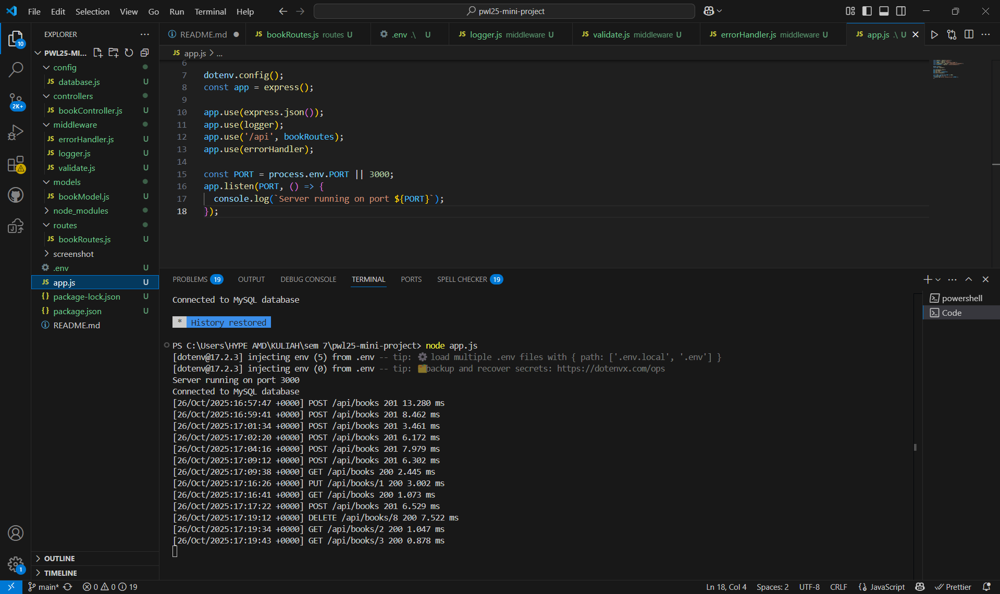

# PWL25 Mini Project - Books API

## Identitas
- Nama : Nurul Fatimah
- NIM  : F1D022085

## Deskripsi Tugas
Tugas REST API sederhana untuk muntuk mengelola data buku (Books API) dengan operasi CRUD (Create, Read, Update, Delete). API ini dibangun menggunakan Express.js sebagai framework Node.js dan MySQL sebagai database. Struktur kode mengikuti pola MVC (Model-View-Controller), ditambah dengan middleware untuk meningkatkan fungsionalitas seperti logging, validasi, dan penanganan error.

## Tujuan
- Membuat sistem yang memungkinkan pengguna (via Postman atau aplikasi lain) untuk:
    - Melihat semua buku (GET /api/books).
    - Melihat detail buku berdasarkan ID (GET /api/books/:id).
    - Menambahkan buku baru (POST /api/books).
    - Memperbarui buku berdasarkan ID (PUT /api/books/:id).
    - Menghapus buku berdasarkan ID (DELETE /api/books/:id).
- Menggunakan database MySQL untuk menyimpan data secara persistensi.

## Struktur Folder
- `config`: Konfigurasi koneksi ke database MySQL.
- `controllers`: Berisi logika untuk menangani request dari endpoint API.
- `models`: Berisi fungsi untuk berinteraksi dengan tabel database.
- `routes`: Definisi endpoint API untuk operasi CRUD.
- `middleware`: Mengandung logger (mencatat request), validate (memvalidasi input), dan errorHandler (menangani error).
- `screenshots`: Folder untuk menyimpan hasil uji coba API menggunakan Postman.

## Alur kerja
1. Server Dimulai: File app.js memulai server Express dan mendefinisikan middleware serta route.
2. Koneksi Database: File config/database.js menghubungkan aplikasi ke MySQL berdasarkan konfigurasi di .env.
3. Request Diproses: Ketika ada request HTTP (misalnya dari Postman), route di routes/bookRoutes.js mengarahkan ke controller yang sesuai.
4. Logika Bisnis: Controller di controllers/bookController.js memanggil model di models/bookModel.js untuk berinteraksi dengan database.
5. Respons Dikembalikan: Hasilnya dikirim kembali ke klien dalam format JSON.

## Screenshot
### 1. GET Ambil semua buku
**Output:**

### 2. GET  Ambil Buku Berdasarkan ID    
**Output:**

### 3. POST  Tambah Buku Baru    
**Output:**

### 4. PUT  Update buku    
**Output:**

### 5. DELET  Haous buku    
**Output:**

### 6. running di vscode    
**Output:**
